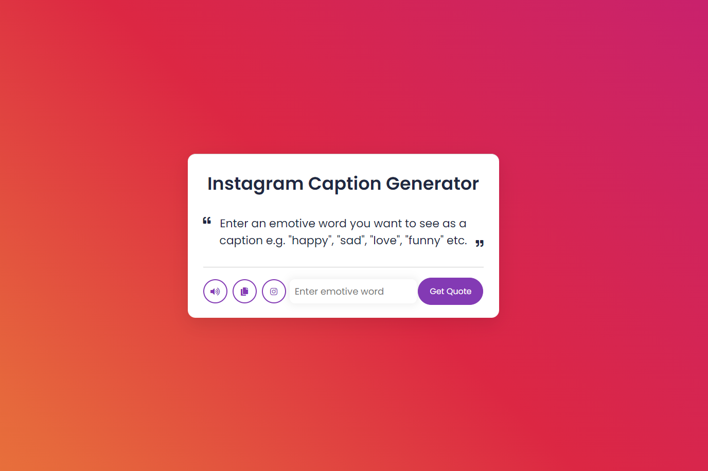
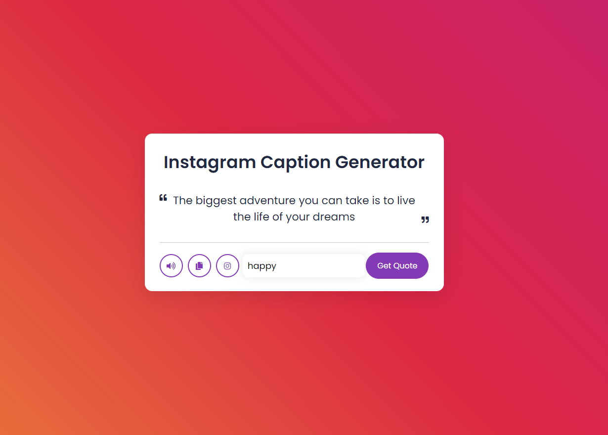

# Instagram Caption Generator

## Project Description
User enters a word they'd like to see as a caption for their newest Intagram posts. The program will then take this input and matches it with the appropriate array and returns the correct caption or quote to the screen. User also has option to use text-to-speech, copy caption to clipboard, and be directed to the Instragam page    

## Screenshots

## Features 
* Speech API button
* Copy to clipboard button
* Directs user to Instgram button

## How to use
User inputs a emotive keyword such as 'happy', 'funny' or 'sad' into the textfield, and clicks on the 'Get Quote' button. A caption will subsequently output to the screen relevant to that keyword  
 
 ## Technologies
 * HTML
 * CSS
 * JavaScript       
          
